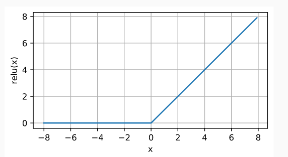
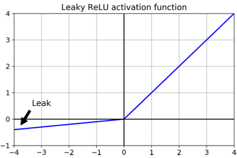
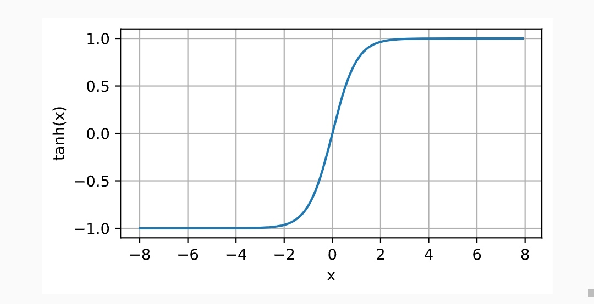
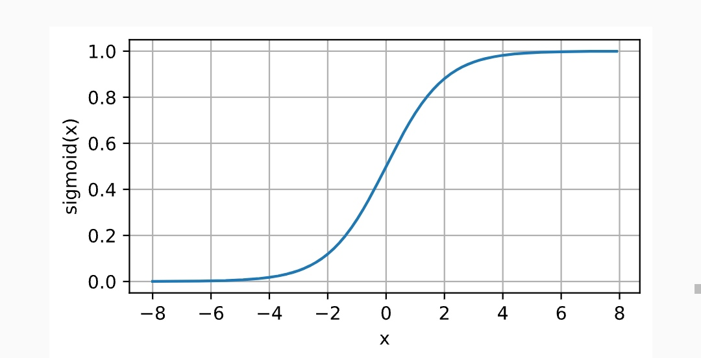
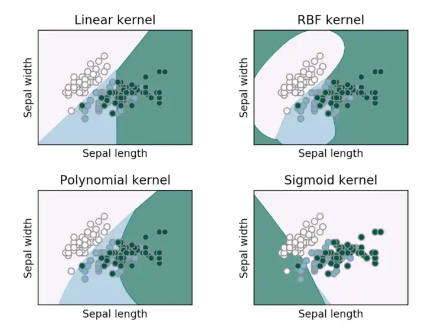
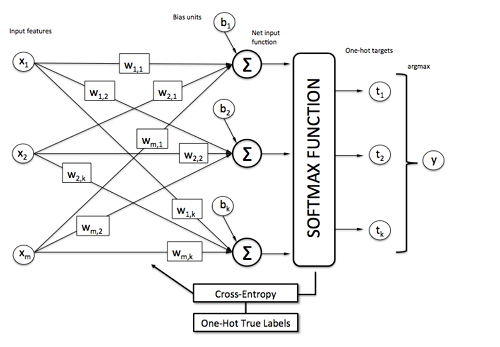

# AICheatSheet
A non-exhaustive cheat sheet about what I learned in AI during the last months, mostly about Classification, Computer Vision and Natural Language Processing.

# Table of Contents
* [1. Data](#data)
	* [1.1 Preprocessing](#preprocessing)
* [2. Neural Networks](#neural-networks)
	* [2.1 Activation Functions](#activation-functions)
		* [Rectified Linear Unit (ReLU)](#relu)
		* [Leaky Rectified Linear Unit (Leaky ReLU)](#relu)
		* [Tanh](#tanh)
		* [Sigmoid](#sigmoid)
	* [2.2 Models]()
		* [Machine Learning](#machine-learning)
			* [k-Nearest Neighbor (kNN)](#knn)
			* [Support Vector Machine (SVM)](#svm)
			* [Softmax Classifier](#softmax-classifier)
			* [Multi-Layer Perceptron](#mlp)
		* [Deep Learning](#deep-learning)
			* [Convolutional Neural Network (CNN)](#convolutional-neural-network)
			* [Recurrent Neural Network (RNN)](#recurrent-neural-network)
* [3. Training](#training)
	* [3.1 Loss functions](#loss-functions)
		* [Hinge Loss](#hinge-loss)
		* [Cross-Entropy Loss](#cross-entropy-loss)
		* [Log Loss](#log-loss)
		* [Mean Squared Error (MSE)](#mse)
		* [Likelihood Loss](#likelihood-loss)
	* [3.2 Regularization functions](#regularization-functions)
		* [L1 Norm](#l1-norm)
		* [L2 Norm](#l2-norm)
		* [Dropout](#dropout)
	* [3.3 Normalization functions](#normalization-functions)
		* [Softmax](#softmax)
		* [Batch Normalization](#batch-normalization)
	* [3.3 Stochastic Gradient Descent (SGD)](#stochastic-gradient-descend-sgd)
		* [Gradient](#gradient)
		* [Forward Propagation](#forward-propagation)
		* [Backward Propagation](#backward-propagation)
* [4. Sources](#sources)
	

---

# Data
## Preprocessing
*@TODO*

# Neural Networks
## Activation Functions
> The main role of an activation function is to add **non-linearity** into the output of a neuron.
>
> These functions will decides if a neuron should be **activated** *(letting signal flow through)* or not.

[//]: #relu

Rectified Linear Unit (ReLU)

 

* The most popular choice due to its simplicity of implementation and its good performances
* It's a simple non-linear transformation defined as the maximum of that element and 0 
* Can prevent **vanishing gradient** problem.

$$ \operatorname{ReLU}(x) = \max(x, 0) $$

[//]: #leaky-relu

Leaky Rectified Linear Unit (Leaky ReLU)

 

* Variant of [ReLU](#relu) activation function.
* It permit some informations to still get through the network even when the argument is **negative**.

$$\operatorname{leaky ReLU}(x) = \max(0, x) + \alpha \min(0, x)$$
* Where $\alpha$ is a learnable parameter.

[//]: #tanh

Tanh

 

* Known as **Hyperbolic Tangent**
* A simple non-linear transformation that squashes its input in a range of (-1, 1)
$$\operatorname{tanh}(x) = \frac{1 - \exp(-2x)}{1 + \exp(-2x)}$$

[//]: #sigmoid

Sigmoid

 

* Use to interpret the output as probabilities for **binary classification problems**
* Often replaced by a [ReLU](#relu) because it can causes **vanishing gradients**
* Squashes its input between 0 and 1

---
## Models

### Machine Learning

[//]: #KNN

k-Nearest Neighbor (kNN)

* It classifies a new entry by assigning it to the class of its closests neighbors.
* $k$ is the number of neighbors (datapoints) to compare to our new data point.
* It's a **non-parametric** approach
* When $k = 1$ *(also called 1-nearest neighbor)*
	* The algorithm will always achieve a training error of **zero**.
	* The algorithm is **consistent** *(eventually converging to the optimal predictor)*
* Requires to specify **distance function** $d$:
	* **Euclidian Distance** is the most popular

[//]: #SVM

 Support Vector Machine (SVM)

* It tries to find a line that **maximises** the separation between a **two-class** (SVM) or more (Multiclass SVM) dataset.
* The datapoints with the minimum distance to the hyperplane are called **Support Vectors**.
* Use the [hinge loss](#loss-functions) to threshold the result to 0 if the correct score is greater than the incorrect class score by at least the margin.
	* The SVM only cares if the difference is lower than the margin $\Delta$
* Similar results as [Softmax Classifier](#softmax-classifier)
* Can performs **non-linear** classifications using a **kernel trick**, implicitly mapping their inputs into high-dimensional feature spaces.
* The different **kernel functions** will define the smoothness and efficiency of the separation :
	* Linear
	* Polynomial
	* Gaussian
	* Sigmoid
	* Radial Basis Function (RBF)

[//]: #softmax-classifier

 Softmax Classifier 

* Similar architecture and results as [Support Vector Machine](#svm) (SVM), but uses a [Cross-Entropy Loss](#cross-entropy-loss)
* Outputs a **propabilistic** interpretation *(due to [softmax](#softmax))*
	* All the outputs values of the function will be scaled between 0 and 1
* Provides kind of probabilities that are easier to interpret than SVM.

[//]: #mlp

 Multi-Layer Perceptron (MLP) 

* A **fully-connected feedforward** neural network.
* Contains **hidden layers** between input and output.
*  It can distinguish data that is not **linearly separable**.
* We can compute the different layers this way:

$$H = \sigma(X{W}^{(1)} + b^{(1)})$$

$$ \mathbf{O} = \mathbf{H}\mathbf{W}^{(2)} + \mathbf{b}^{(2)} $$

* Where $H$ is the **hidden layer,** $\sigma$  is the **activation function**, $X$ is the **input data,** $W$ is the **weights,** $b$ is the **bias**, $O$ is the **output layer**.

---
### Deep Learning
#### Convolutional Neural Network

*@TODO*

---

#### Recurrent Neural Network
*@TODO*

---
# Training
## Loss functions

> The role of a loss function *(also called cost function)* is to evaluate the error between the prediction and the targetted value.

[//]: #hinge-loss

 Hinge Loss

* Also known as **maximum-margin loss**.
* Used for training in **maximum-margin** classification.
* Known for being used in [Support Vector Machine](#svm) (SVM)
$$\ell(y) = max(0, 1 - t \cdot y)$$
* Where $t$ is the **actual outcome** *(either -1 or 1)* and $y$ is the **output** of the classifier. 

[//]: #cross-entropy-loss

 Cross-Entropy Loss

- Used in **binary** and **multiclass** classification
* **Entropy** means the average level of randomness or uncertainty.
* It measures the difference between **two probability distributions**:
	1. The discovered probability distribution of a ML classification model
	2. The predicted distribution
* Often compared to [log loss](#log-loss)
* **Binary** Cross-Entropy Loss:
$$l = -(ylog(p) + (1 - y)log(1 - p))$$
* Where $p$ is the *predicted probability* and $y$ is the *actual outcome* (0 or 1)
* **Multiclass** Cross-Entropy Loss:
$$l =-\sum_i^C y_i log(p_i)$$
* Where $y_i$ is the *actual outcome*, $p_i$ is the *predicted probability* of the $i^{th}$ label, and $C$ the *number of classes*
* We calculate a separate loss for each label and sum the result.

[//]: #log-loss

 Log Loss

*@TODO*

[//]: #mse

 Mean Squared Error (MSE)

*@TODO*

[//]: #likelihood-loss

 Likelihood Loss

*@TODO*

---

## Regularization Functions

[//]: #l1-norm

 L1 Norm

*@TODO*

[//]: #l2-norm

 L2 Norm

*@TODO*

[//]: #dropout

 Dropout 

*@TODO*

---
## Normalization Functions

[//]: #softmax

Softmax

* Convert a vector of real numbers into a *probability distribution* of these outcomes
* Often used as the last *activation-functions* of a Neural Network to normalizes ouptuts as probabilities
* Often paired with **argmax** function that permits to get the highest probability
$$\sigma(z_i) = \frac{e^{z_{i}}}{\sum_{j=1}^K e^{z_{j}}}$$
* Where $z$ is the vector of *raw outputs* from the Neural Network, $K$  is the number of classes.
	* We divide the exponential of one element of the output to the sum of all exponentials values of the output vector.

[//]: #batch-normalization

Batch Normalization

*@TODO*

---

## Stochastic Gradient Descend (SGD)
[//]: #gradient

 Gradient

*@TODO*

[//]: #forward-propagation

 Forward Propagation

*@TODO*

[//]: #backward-propagation

 Backward Propagation

*@TODO*

--- 
# Sources
* https://cs231n.github.io/
* https://www.v7labs.com/blog/neural-networks-activation-functions
* https://www.geeksforgeeks.org/activation-functions-neural-networks/
* https://towardsdatascience.com/activation-functions-neural-networks-1cbd9f8d91d6
* https://en.wikipedia.org/wiki/Multilayer_perceptron
* https://d2l.ai/chapter_multilayer-perceptrons/index.html