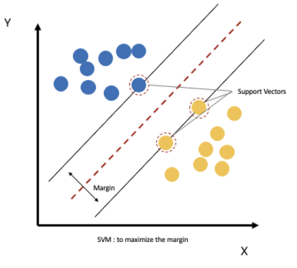
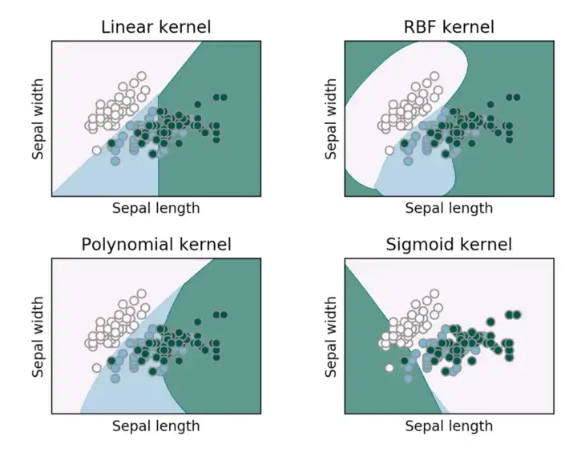

# AICheatSheet
A non-exhaustive cheat sheet about what I learned in AI during the last months.

# Table of Contents
1. [Data Preparation](#data-preparation)
2. [Models](#models)
	1. [Linear models](##linear-models)
3. [Training](#training)
	1. [Loss functions](#loss)
	
# Data Preparation
# Models
## Linear models

k-Nearest Neighbor (kNN)

* It classifies a new entry by assigning it to the class of its closests neighbors.
* $k$ is the number of neighbors (datapoints) to compare to our new data point.
* It's a **non-parametric** approach
* When $k = 1$ *(also called 1-nearest neighbor)*
	* The algorithm will always achieve a training error of **zero**.
	* The algorithm is **consistent** *(eventually converging to the optimal predictor)*
* Requires to specify **distance function** $d$:
	* **Euclidian Distance** is the most popular

 Support Vector Machine and Multiclass Support Vector Machine (SVM)

* It tries to find a line that maximises the separation between a **two-class** (SVM) or more (Multiclass SVM) dataset.
* The datapoints with the minimum distance to the hyperplane are called **Support Vectors**.
* Requires to specify a **kernel function** to compute datapoint separation:
	* Linear
	* Polynomial
	* Gaussian
	* Sigmoid
	* Radial Basis Function (RBF)

	

These functions will determine the smoothness and efficiency of class separation.

---
# Training