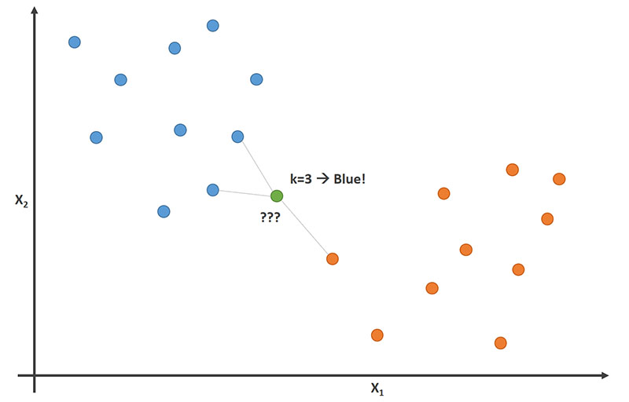

# AICheatSheet
A non-exhaustive cheat sheet about what I learned in AI during the last months.

# Table of Contents
1. [Linear models]()
	1. [k-Nearest Neighbor (kNN)]()
## Linear models

### k-Nearest Neighbor (kNN)

- $k$ is the number of neighbors (datapoints) to compare to our new data point.

-  When $k = 1$ *(also called 1-nearest neighbor)*
	- The algorithm will always achieve a training error of **zero**.
	- The algorithm is **consistent** *(eventually converging to the optimal predictor)*

